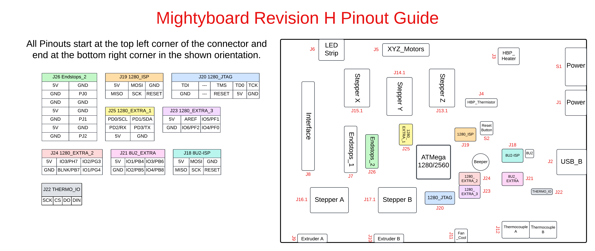
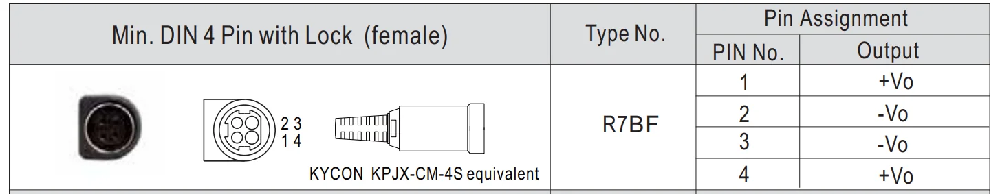

# Mightyboard
Pin mappings for the Makerbot Mightyboard Rev E, Rev G, and Rev H. The Rev E was used in the Replicator 1 and 1 Dual Printers. The Rev G and Rev H were used in the Replicator 2 and 2X printers.

Regarding the Rev G and Rev H, the physical locations of the pins are the same between the two boards, only the `J` designation is different.

Mightyboard Revision E

## Mightyboard Revision E
The [Mightyboard Rev E is fully open source from Makerbot themselves.](https://www.thingiverse.com/thing:16058) It and other electronic parts of the Replicator 1 family can be found at [Makerbot's Thingiverse page](https://www.thingiverse.com/makerbot/designs). Most of the useful parts are on pages 23-27, I recommend sorting the designs by oldest to newest.

## Schematic

All files for the board can be found in the [Mightyboard_Rev_E Folder](Documentation\Mightyboard\Mightyboard_Rev_E)

Mightyboard Revision G

## Mightyboard Revision G
[Table of Connectors](Mightyboard_Rev_G/Connectors.md)

[Pins in Use](Mightyboard_Rev_G/Pins_in_use.md)

## Physical Notes
|            Rev G             |
|------------------------------|
| Beeper on underside of board |
| Includes a pcb_fan header    |

## Pinout Guide

Pictures of the board can be found in the [Documents](Documents) folder.

Mightyboard Revision H

## Mightyboard Revision H
[Table of Connectors](Mightyboard_Rev_H/Connectors.md)

[Pins in Use](Mightyboard_Rev_H/Pins_in_use.md)

## Physical Notes
|            Rev H            |
|-----------------------------|
| Beeper on top side of board |
| Missing a pcb_fan header    |

## Pinout Guide

Pictures of the board can be found in the [Documents](Documents) folder.

# Major Components on Rev G and Rev H Boards

|     Component Function      |        Component Name       |          Datasheet          |
|-----------------------------|-----------------------------|-----------------------------|
|             MCU             |       ATMega 1280/2560      | [Datasheet](Documents/ATmega640-1280-1281-2560-2561-Datasheet.pdf) |
|      Thermocouple ADC       |           ADS1118           | [Datasheet](Documents/ads1118.pdf) |
|      Bed Heater Mosfet      |     PSMN7R0-30YL SOT669     | [Datasheet](Documents/PSMN7R0-30YL.pdf) |
|    Hotend Heater Mosfets    |     PSMN7R0-30YL SOT669     | [Datasheet](Documents/PSMN7R0-30YL.pdf) |
|     Extruder Fan Mosfets    |        2N7002K SOT23        | [Datasheet](Documents/2N7002K.PDF) |
|       Part Fan Mosfet       |        2N7002K SOT23        | [Datasheet](Documents/2N7002K.PDF) |
|          Interface          |          ATMega8U2          | [Datasheet](Documents/ATmega8U2-16U2-32U2-Datasheet.pdf) |

# Power Supply Connector Pinout

[Socket Datasheet](Documents/Kycon_KPJX-CM-4S.pdf)

[Plug Datasheet](Documents/Kycon_KPPX-4P.pdf)